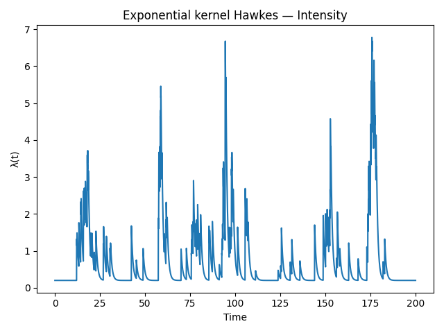
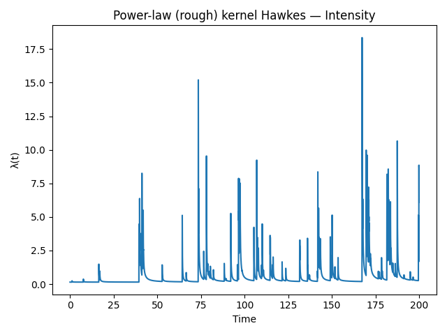
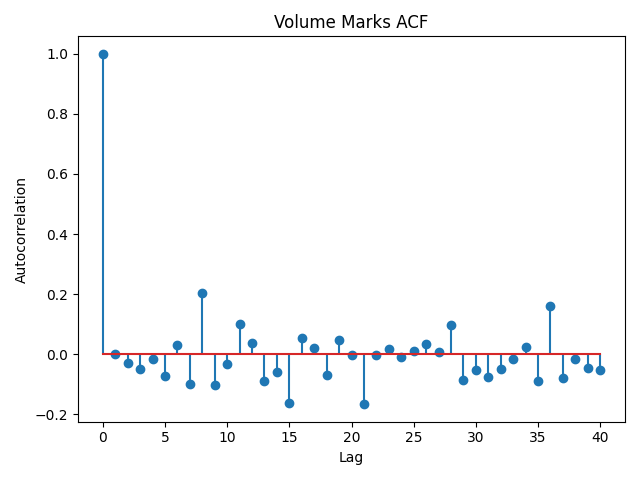
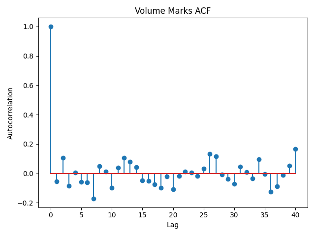
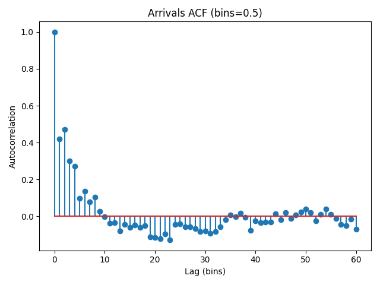

# High-Frequency Trading Simulator

[](https://www.python.org/)
[](https://cmake.org/)
[](https://streamlit.io/)
[](docs/USAGE.md#execute-tests)
[](docs/USAGE.md#execute-tests)

[](https://your-streamlit-deployment.example)
[](docs/USAGE.md)

A practical sandbox for market microstructure research. Explore how clustered order flow emerges from Hawkes processes, prototype execution logic on a deterministic C++ limit order book, and surface results through notebooks, scripts, and a guided Streamlit front end.

## At a Glance
- **Deterministic order book core** – Modern C++17 engine with price-time priority kept intentionally readable for experimentation.
- **Shared Hawkes kernels** – Exponential and power-law intensity implementations exposed to both C++ and Python.
- **Analytics & visualization** – Python package with thinning simulators, diagnostics, plots, and export utilities.
- **Interactive Streamlit app** – Visualise timelines, compare kernels, and download simulated order flow without touching a compiler.
- **Reproducible artefacts** – Synthetic datasets, plots, and experiment outputs tracked under `data/` and `docs/`.

## Table of Contents
- [Quick Start](#quick-start)
- [Interactive Streamlit App](#interactive-streamlit-app)
- [Documentation](#documentation)
- [Research Benchmarks](#research-benchmarks)
- [Repository Layout](#repository-layout)
- [Working with Data & Plots](#working-with-data--plots)
- [Theory Snapshot](#theory-snapshot)
- [Example Outputs](#example-outputs)
- [Development Notes](#development-notes)
- [Roadmap Ideas](#roadmap-ideas)

## Quick Start
Need more context? The step-by-step guide in `docs/USAGE.md` covers the full workflow end to end.

### Prerequisites
- CMake ≥ 3.15 and a C++17-capable compiler (Clang, GCC, or MSVC).
- Python 3.10+ with `pip` for the analytics layer and Streamlit app.

### Build the C++ Simulator
```bash
cmake -S . -B build/release -DCMAKE_BUILD_TYPE=Release
cmake --build build/release --target hft_sim
./build/release/hft_sim
```

### Run the Hawkes Example (C++)
```bash
cmake --build build/release --target hawkes_example
./build/release/hawkes_example
```

### Execute Tests
```bash
cmake -S . -B build/tests -DHFT_ENABLE_TESTS=ON -DCMAKE_BUILD_TYPE=Debug
cmake --build build/tests --target order_tests
ctest --test-dir build/tests --output-on-failure
```

### Explore the Python Package & Demos
```bash
cd python
python3 -m venv .venv
source .venv/bin/activate            # Windows: .venv\Scripts\activate
pip install -r requirements.txt
MPLCONFIGDIR=.matplotlib python3 -m demo
```
The demo prints branching ratios, generates intensity/ACF plots saved to `docs/images/`, and exports event streams to `data/runs/`.

## Interactive Streamlit App

Launch the pedagogy-first Streamlit interface to experiment with Hawkes processes visually:

```bash
cd python
streamlit run streamlit_app.py
```

Inside the app you can:
- Pick preset market regimes (Calm Market, Frenzy, Flash Crash) or define your own parameters.
- Toggle between exponential and power-law kernels and overlay comparison runs.
- Inspect branching ratios with criticality warnings and view order-size histograms.
- Export simulated order flow as CSV or download calibration notebooks directly from the sidebar.

The app bridges directly to the native C++ kernels via `bridge_utils.ensure_bridge_path`, so ensure build artefacts exist under `build/lib` (or set `HFT_HAWKES_BRIDGE`).

## Documentation
- **Usage Guide** — `docs/USAGE.md` deep-dives into build configuration, order book APIs, Hawkes simulators, Python tooling, and troubleshooting tips.
- **Research Primer** — `docs/research_primer.md` covers Hawkes theory, branching interpretation, and diagnostics for market microstructure.
- **Benchmark Protocol** — `docs/benchmark_protocol.md` explains how to reproduce multi-symbol experiments and report comparable metrics.
- **Notebooks** — `docs/notebooks/` contains ready-to-run calibration notebooks for synthetic and Binance datasets.
- **Paper snippets** — `docs/paper/results.tex` provides LaTeX-ready tables/figures plus a reproducibility checklist.

## Research Benchmarks

### Prepare Datasets
- **Binance BTCUSDT (2025-09-21)**
  ```bash
  python scripts/pack_binance_npz.py \
    --input-dir data/runs/events \
    --symbol BTCUSDT \
    --days 2025-09-21 \
    --output data/runs/events/binance_btcusdt_2025-09-21.npz
  ```
  Produces the NPZ plus a companion metadata JSON describing symbol/day and preprocessing options.
- **LOBSTER AAPL (2012-06-21)**
  ```bash
  python scripts/preprocess_lobster.py \
    --messages data/lobster/LOBSTER_SampleFile_AAPL_2012-06-21_10/\\
      AAPL_2012-06-21_34200000_57600000_message_10.csv \
    --symbol AAPL \
    --date 2012-06-21 \
    --output data/runs/events/lobster_aapl_2012-06-21_sample.npz
  ```
  Adapt the path if you download additional sessions; a `.meta.json` file records the seed and filters used.

### Train GRU and Transformer Backbones
```bash
export PYTHONPATH=.
PYTHONPATH=. python experiments/run_matrix.py \
  --config experiments/configs/binance_backbones.json \
  --results-dir experiments/results \
  --run-dir experiments/runs

PYTHONPATH=. python experiments/run_matrix.py \
  --config experiments/configs/lobster_backbones.json \
  --results-dir experiments/results \
  --run-dir experiments/runs
```
Each run logs deterministic seeds and checkpoints. Artefacts land in `experiments/runs/<experiment_id>/`:

- `metrics.json` summarises Train/Val/Test NLL, MAE, accuracy, KS stats, runtime, and parameter count.
- `curves/` stores CSVs for loss and calibration bins.
- `figs/` holds paper-ready loss/QQ/KS/calibration plots (PNG, 300 dpi).

### Aggregate & Summaries
- Collect per-run metrics into a single CSV:
  ```bash
  python scripts/collect_runs.py \
    --run-dir experiments/runs \
    --output experiments/summary/benchmarks.csv
  ```
- Generate the markdown table, ablation figure, and copy best plots:
  ```bash
  python scripts/prepare_summary_assets.py
  ```
  Outputs appear under `experiments/summary/` and can be dropped straight into a manuscript.

### Additional Research Utilities
- `neural_hawkes.py` exposes a JSON-driven `run_experiment` function with CLI logging (`--output`) and diagnostics (KS/QQ statistics, runtime).
- `experiments/run_matrix.py` executes matrices of configs (see `experiments/configs/`); summarise with `experiments/aggregate_results.py`.
- Diagnostics span time-rescaling QQ/KS plots, runtime comparisons, and branching statistics for publication-ready benchmarking.

## Repository Layout
- `src/` — C++ sources (`OrderBook`, Hawkes kernels, example apps).
- `tests/` — Catch2-based regression tests for order handling.
- `python/` — Hawkes simulation package (`kernels.py`, `simulate.py`, `viz.py`, Streamlit app, etc.).
- `data/` — Sample CSV/JSON runs produced by the demos.
- `docs/images/` — Generated figures used for reporting or documentation.
- `experiments/` — Configuration grids, scripts, and aggregated results for neural Hawkes benchmarks.

## Working with Data & Plots
- Regenerate datasets via `python -m demo`; outputs are deterministic with the seeded RNGs.
- High-resolution figures are committed for convenience; consider Git LFS if you plan to add many binary assets.
- `python/io.py` centralizes CSV/JSON serialization so you can swap in alternative storage formats with minimal changes.

## Theory Snapshot
- **Limit-order dynamics** — the C++ core models submissions, cancellations, and executions with price-time priority, letting you observe queue evolution as a discrete-event system.
- **Hawkes intensity** — arrivals follow `λ(t) = μ + \sum_i φ(t - T_i, V_i)`, capturing self-excitation where past trades raise the probability of near-future activity.
- **Kernel choices** — the exponential kernel `φ(u,v)=α v e^{-βu}` yields Markovian state updates; the power-law alternative `φ(u,v)=α v (u+c)^{-γ}` captures longer memory but requires `γ>1` to stay integrable.
- **Branching ratio** — expected offspring per event, `n = E[φ]`; keeping `n < 1` (subcritical regime) ensures the simulated process does not explode, mirroring stable market flows.
- **Marks** — random volumes (log-normal, exponential, deterministic) feed back into intensity, providing a stylised link between trade size and subsequent activity.

## Example Outputs

Below are sample outputs from the Hawkes simulator, comparing exponential and power-law kernels.

### Intensity Paths
- **Exponential kernel Hawkes**
  

- **Power-law (rough) kernel Hawkes**
  

### Autocorrelation Functions
- **Volume marks ACF**
  

- **Volume marks ACF (alt run)**
  

- **Arrival process ACF**
  

## Development Notes
- Keep commits focused (parameter tuning, new kernels, plotting tweaks).
- Record RNG seeds alongside configuration in `data/runs/*.json` for reproducibility.
- When contributing kernels or strategies, add tests under `tests/` and plots/examples under `docs/` so results stay reproducible.

## Roadmap Ideas
1. Extend the order book with latency models and queue-position analytics.
2. Expose a REST/gRPC shim for streaming orders to the simulator.
3. Package the Python tooling for pip installation and add notebook tutorials.
4. Wire CI (Catch2 + lint + demo smoke test) to keep the repo production-ready.

Feel free to fork and adapt—this project is meant to be a sandbox for experimentation as much as a reference implementation.
