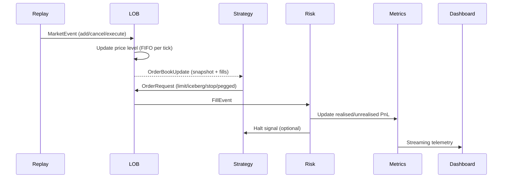

# Architecture Overview

This simulator couples a deterministic C++ limit order book with a Python backtester
and analytics toolchain. The design keeps the hottest code paths in C++ while
surfacing a clean Python interface for orchestration and diagnostics.

## Component Map

```mermaid
flowchart LR
    subgraph Data Feed
        ITCH[ITCH / CSV / Replay]
    end
    subgraph Core
        LOB[OrderBook (C++)]
        Risk[RiskEngine (Python)]
        Metrics[MetricsLogger]
    end
    subgraph Strategy Layer
        Strat[Strategy callbacks]
    end
    subgraph Telemetry
        Replay[ReplayEngine]
        Dashboard[RiskDashboard]
        Docs[Metrics / Reports]
    end

    ITCH -->|MarketEvent| Replay
    Replay -->|MarketEvent| LOB
    LOB -->|OrderBookUpdate| Strat
    Strat -->|OrderRequest| LOB
    LOB -->|FillEvent| Risk
    Risk --> Dashboard
    Risk --> Metrics
    Metrics --> Docs
```

The flow mirrors Nasdaq TotalView-ITCH 5.0 replay semantics: every inbound message
is timestamped and processed in order, induces fills/cancels, and updates derived
state before the next message is consumed [Nasdaq TotalView-ITCH 5.0, §3].

## Event Lifecycle



## C++ Core
- **OrderBook** (`src/OrderBook.*`): price-time priority with aggregated levels,
  integer-tick prices, cancel-by-id maps, iceberg replenishment, pegged
  repricing, and stop-order triggers. Designed following the data-structure
  guidelines in *A High-Performance Order Book* (ACM Queue, 2023).
- **RiskEngine** keeps position, realised/unrealised PnL, notional exposure, and
  halts strategies when thresholds breach.
- **MetricsLogger** records orders, fills, snapshots, and run summaries to JSONL
  or SQLite for deterministic regression analysis.

## Python Backtester
- **ReplayEngine** streams historical messages at accelerated or wall-clock
  speeds for deterministic replays.
- **ConcurrentBacktester** optionally decouples ingestion, strategy execution,
  and order submission on separate threads while preserving order semantics.
- **Strategies** implement a small callback surface (`on_market_data`,
  `on_fill`, `on_timer`). They interact with the book through the
  `StrategyContext`, ensuring all mutations occur inside the C++ core.

## Documentation Toolchain
- **Doxygen** (enabled with `cmake -DENABLE_DOCS=ON`) generates API pages for
  the public headers under `src/`.
- **Architecture & Invariants** (this document and `docs/invariants.md`) capture
  the contract relied upon by strategies, replays, and analytics.
- The generated HTML lives under `build/docs/html/` when the docs target is built.

## Data Flow Invariants
The invariants that keep the system deterministic and replayable are documented
in `docs/invariants.md`. In short:

1. Market events are processed strictly in timestamp order.
2. Consistent integer tick representation avoids floating-point drift.
3. Every order is uniquely addressable for cancels and order-amend handling.
4. Callbacks observe a single source of truth snapshot after each event.

Refer to the invariants document for the complete list.

