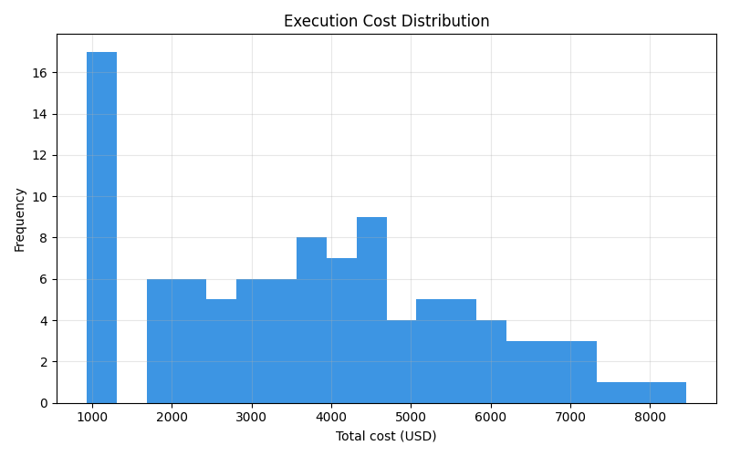
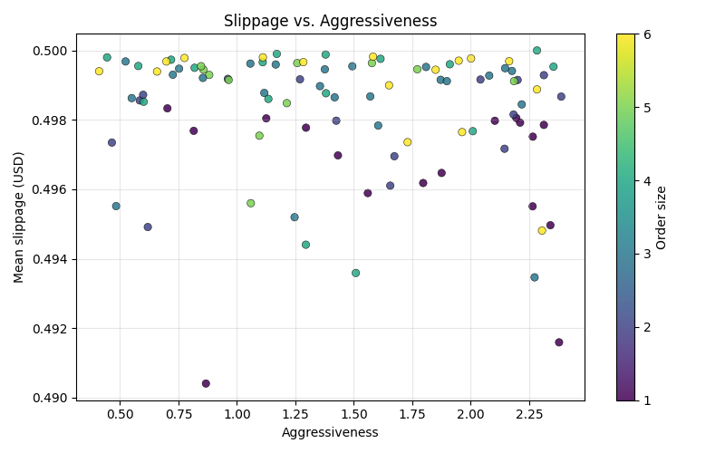
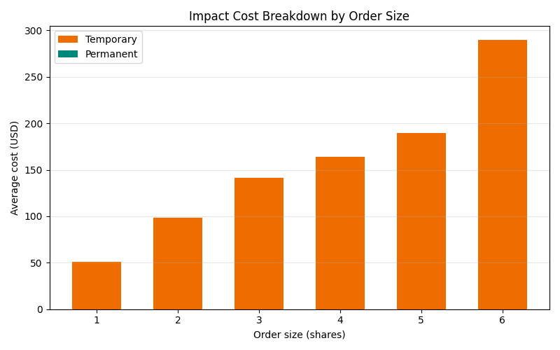
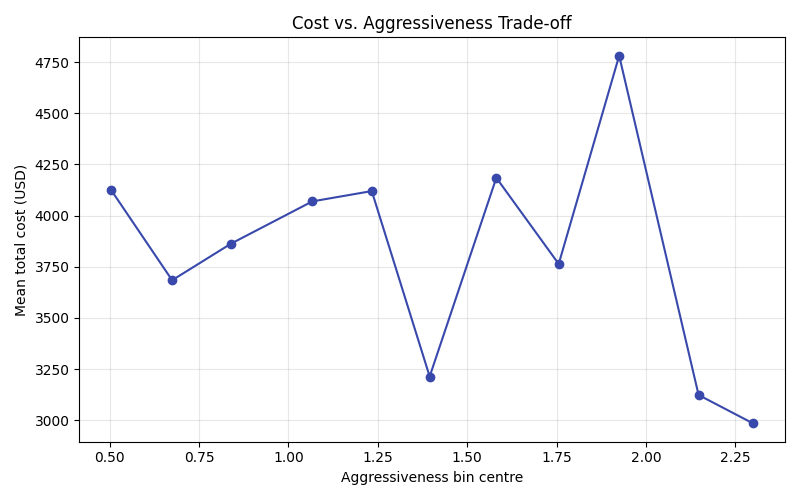

# Week 6 – Execution Cost Analysis

## Almgren–Chriss impact model

We model execution costs with the Almgren–Chriss split between temporary and permanent impact:

\[
C(v) = \eta \cdot v + \frac{\gamma}{2} v^2
\]

where \(v\) is the participation rate (shares per second), \(\eta\) controls the temporary liquidity premium, and \(\gamma\) captures persistent market impact. In implementation we decompose the realised cost per order as

- **temporary cost** = \(\eta\,|q|\,a\) where \(|q|\) is the filled volume and \(a\) the aggressiveness factor,
- **permanent cost** = \(\tfrac{1}{2}\gamma |q|^2\),
- **implementation shortfall** = signed slippage \(\times |q|\).

Each executed order records execution price, signed slippage, and the temporary/permanent components so downstream analytics can operate on per-trade detail.

## Simulation setup

- 2D exponential Hawkes process for market order arrivals (Binance BTCUSDT calibration).
- Market orders sized from 1–6 lots sampled uniformly each run.
- Aggressiveness drawn uniformly in \([0.4, 2.4]\) and fed into the cost model.
- Temporary impact jittered \(\eta \sim \mathcal{N}(0.015, 0.002)\) per run; permanent impact fixed at \(2.5\times 10^{-6}\).
- 100 Monte Carlo sessions, 60 s horizon, independent seeds (offset by run id).
- `execution_cost_runner` writes run-level metrics to `results/week6/execution_cost_analysis.csv`.

## Headline metrics

| Metric | Value |
| --- | ---: |
| Monte Carlo runs | 100 |
| Average implementation shortfall | 3,619.54 |
| Expected cost variance | 3,599,976.03 |
| Mean aggressiveness | 1.46 |
| Mean order size | 3.38 |

_Source: `results/week6/execution_cost_summary.json`_

## Visual diagnostics

The trade-off curve uses bin-averaged costs (11 bins across the sampled aggressiveness range) captured in
`results/week6/execution_cost_aggressiveness_curve.csv`.

## Artefacts

- Raw Monte Carlo runs: `results/week6/execution_cost_analysis.csv`
- Summary metrics: `results/week6/execution_cost_summary.json`
- Visuals: `results/week6/figs/`
- Trade-off curve data: `results/week6/execution_cost_aggressiveness_curve.csv`
- Reproducibility: `python/scripts/run_week6_execution_cost.py`
