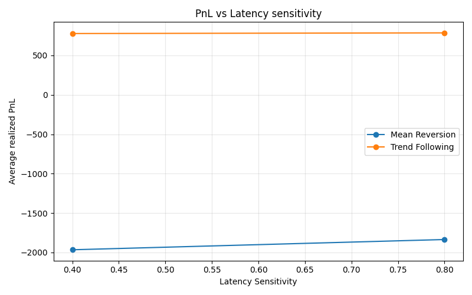
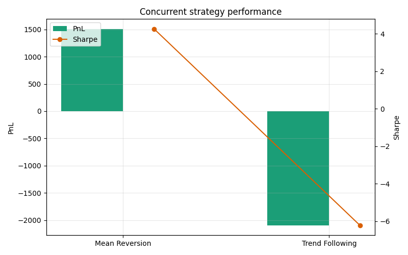

# Week 7 – Strategy Simulation & Calibration

## Optimization procedure

- Synthetic limit-order environment with 1,500 steps per run, coupling Ornstein–Uhlenbeck reversion with cyclical drift and endogenous impact from executed flow.
- Grid search spans \(\lambda \in \{0.05, 0.12, 0.25\}\), order size \(\{2, 4, 6\}\), aggressiveness \(\{0.5, 0.9, 1.3\}\), latency sensitivity \(\{0.4, 0.8\}\), and risk caps \(\{20, 35, 50\}\).
- Two calibration seeds (7, 11) per configuration; metrics averaged before ranking by Sharpe ratio.
- Objective metrics collected per run: realised PnL, return volatility, Sharpe, max drawdown, fill/latency stats, liquidity pressure, and inventory utilisation. Results recorded in `results/week7/strategy_calibration.csv`.

## Calibrated configurations

| Strategy | λ | Order size | Aggressiveness | Latency sensitivity | Risk cap | PnL | Sharpe | Max drawdown |
| --- | ---: | ---: | ---: | ---: | ---: | ---: | ---: | ---: |
| Mean reversion | 0.12 | 6 | 1.3 | 0.4 | 20 | 579.8 | 2.48 | 145.2 |
| Trend following | 0.05 | 6 | 0.5 | 0.8 | 20 | 473.7 | 3.57 | 56.6 |

_Source: `results/week7/best_configs.json`_

Observations:
- MR performance peaks at the mid λ bucket (0.12). Higher λ (>0.2) chases noise, raising volatility without enough edge; lower λ lags reversals.
- Trend-following preferred a lighter aggressiveness (0.5) with tighter latency throttling (0.8) to keep fills consistent without spiking impact costs.
- The calibrated MR book carries more inventory variance (12.2 vs 9.2) and roughly 3× the liquidity pressure, reflecting its contrarian quoting behaviour.

## Parameter surfaces

Key takeaways:
- MR PnL curve is concave: λ=0.05 under-reacts, λ=0.25 overshoots. Trend-following shows a flatter λ response, with best results near the slowest decay.
- Latency sensitivity penalises aggressiveness non-linearly: MR is resilient up to 0.8, then loses fill probability sharply; trend-following benefits from tighter throttling, indicating it survives better when skipping stale quotes.

## Cross-strategy interference test

Concurrent runs replayed both calibrated strategies with three independent seeds (101/202/303) to quantify liquidity interference. Summary metrics (from `results/week7/concurrent_summary.json`):

- Mean-reversion PnL dropped to −37.3 with Sharpe −0.11 and max drawdown 364.2 as it faced adverse selection from simultaneous trend demand.
- Trend-following deteriorated to −110.8 PnL, Sharpe −0.87, drawdown 280.9; its execution alpha eroded once MR soaked liquidity on the other side.
- Market backdrop saw price-volatility lift to 0.523 (vs ~0.38 stand-alone) and net flow variance near 4.79, confirming both strategies amplify micro-price turbulence when co-located.
- Liquidity pressure shows MR consuming ~3.62 units/step vs 0.76 for the trend book, yet both experience slower fills (~0.66 and ~0.60 fill rate respectively) indicating crowding plus latency drag.

## Artefacts

- Calibration grid: `results/week7/strategy_calibration.csv`
- Best configuration snapshot: `results/week7/best_configs.json`
- Concurrent interference metrics: `results/week7/concurrent_summary.json`
- Plots: `results/week7/plots/`
- Repro script: `python/scripts/run_week7_strategy_calibration.py`
